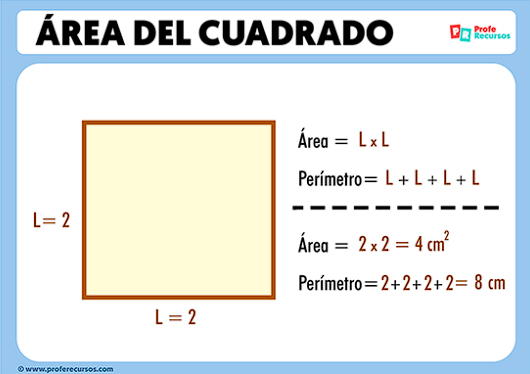
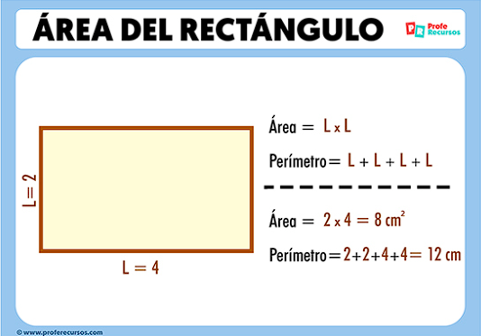
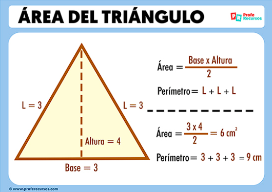

# Exercise Two 

___

> Hallar la  **superficie** de un __cuadrado__ conociendo el _valor_ de un lado.

>> __De aquí en adelante, se modificará el ejercício, para hacerlo más dinámico y útil.__

Se debe tener en cuenta que superficie en este sentido, es lo mismo que área, por lo tanto, la formula aplica para esos dos conceptos.
___
Le añadire más figuras geometricas, las cuales, tendran las formulas en la siguiente lista:

* __Cuadrado:__
    * Área =  Lado * Lado
    * Perimetro = Suma de todos los lados (L + L + L + L)

* __Rectángulo:__
    * Área = Base * Altura
    * Perimetro = (2 * Base )+(2 * Altura)

* __Triángulo:__
    * Área = (Base * Altura) / 2
    * Perimetro = Suma de sus tres lados

* __Círculo:__
    * Área = Pi * (Radio * Radio)
    * Perímetro = (2 * Pi * Radio)

  

___

  Créditos: 
  *  [Enlace sobre las imágenes de apoyo](https://www.proferecursos.com/areas-y-perimetros/)
  * [Enlace propuesta del ejercicio](https://www.tutorialesprogramacionya.com/pythonya/detalleconcepto.php?punto=3&codigo=3&inicio=0)